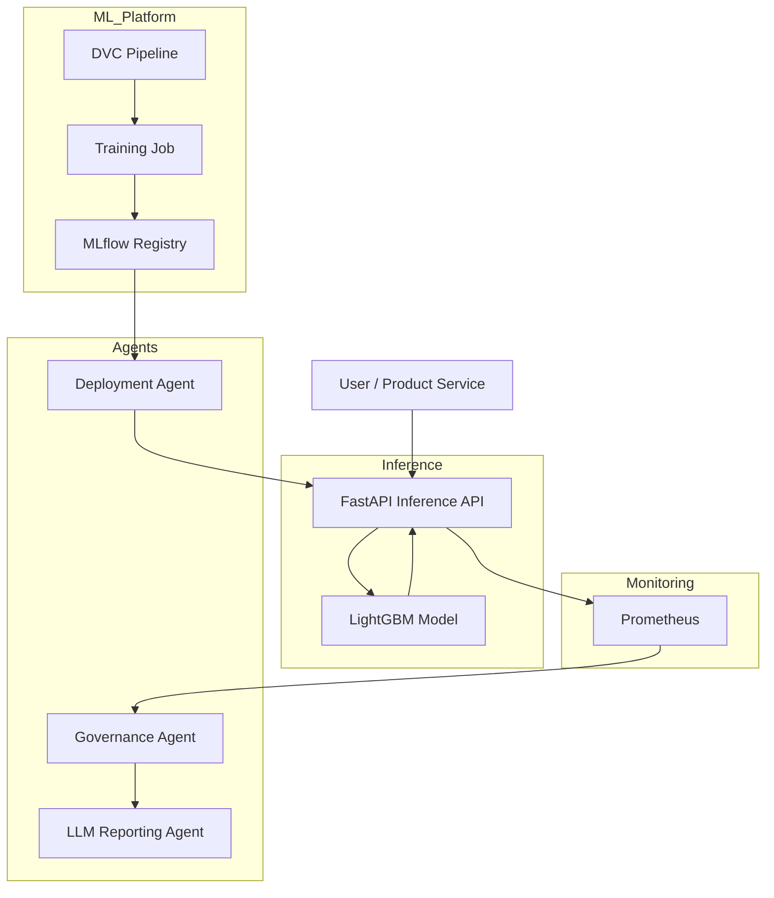
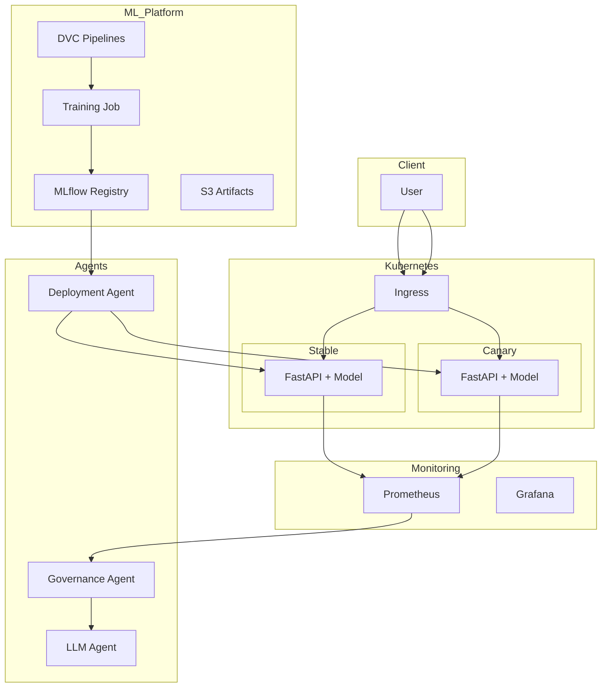
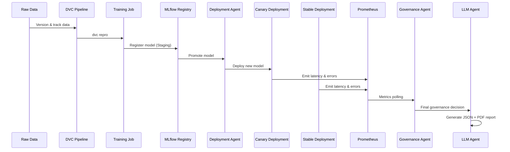

# 🧠 AutoML Brain

### Autonomous Churn Prediction & ML Governance Platform


---

## 📖 Overview

**AutoML Brain** is a **production-grade, autonomous ML platform** built to solve the *real* problems of deploying machine learning systems at scale.

This is **not just a churn prediction model**.

It is an **end-to-end ML lifecycle, deployment, monitoring, and governance system** designed for **subscription-based businesses**, including:

* Streaming platforms (Netflix-like)
* SaaS products
* Telecom subscriptions
* Digital marketplaces

The platform continuously **monitors, validates, deploys, governs, and explains itself** — with minimal human intervention.

---

## ❌ Why Traditional ML Systems Fail

Most ML systems break in production because they:

* Train once and never retrain
* Lack drift detection
* Deploy models unsafely
* Ignore latency and SLA violations
* Depend on manual approvals
* Provide no executive-level visibility

In subscription businesses, **poor ML decisions directly translate to customer churn and revenue loss**.

---

## ✅ What AutoML Brain Solves

AutoML Brain introduces **production-first ML design**, combining:

* Reproducible pipelines (DVC)
* Model lifecycle management (MLflow)
* Kubernetes-native model serving
* Canary deployments with rollback
* Latency & SLA monitoring
* Rule-based ML governance agents
* LLM-generated executive reports

**Outcome:**
➡️ A **self-governing ML system** that is safe, observable, and scalable.

---

## 🧱 High-Level Architecture


---

## 🏗️ Technical Architecture (Layered View)




---

## 🔁 End-to-End System Flow




---

## 🧠 ML Pipeline (Offline)

Managed entirely via **DVC** for reproducibility.

```text
Raw Data
 → Preprocessing
 → Feature Engineering
 → Model Training
 → Evaluation
 → Drift Detection
 → MLflow Registry
```

---

## 🚀 Model Serving (Online)

**FastAPI-based inference service**:

* `POST /predict` — Low-latency inference
* `POST /predict/explain` — SHAP explanations
* `GET /health` — Kubernetes probes
* `GET /metrics` — Prometheus metrics

Model artifacts are **loaded once at startup** and cached in memory to minimize latency.

---

## ⚡ SLA & Performance Targets

| Metric       | Target   |
| ------------ | -------- |
| P95 Latency  | < 400 ms |
| Error Rate   | < 1%     |
| Availability | 99.9%    |


---

## 📈 Monitoring & Observability

* Prometheus scrapes `/metrics`
* Latency histograms
* Error counters
* Throughput metrics

These signals directly feed into **automated governance decisions**.

---

## 🤖 Autonomous Governance Agents

### 1️⃣ Deployment Agent

**Purpose:** Decouple training from serving

* Reads MLflow registry
* Promotes models to Production
* Triggers Kubernetes rollouts

---

### 2️⃣ Governance Agent

**Purpose:** ML SRE automation

* Monitors latency, errors, and SLA
* Compares Canary vs Stable
* Automatically decides:

  * Accept deployment
  * Reject deployment
  * Rollback
  * Scale resources

---

### 3️⃣ LLM Governance Agent

**Purpose:** Executive-level visibility

* Consumes:

  * Model metrics
  * Drift reports
  * SHAP explanations
  * Production SLAs
* Produces:

  * `deployment_report.json`
  * `deployment_report.pdf`

---

## 🔄 CI/CD Strategy

### Why Two Pipelines?

| Pipeline              | Trigger       | Responsibility   |
| --------------------- | ------------- | ---------------- |
| `inference-cicd.yaml` | Every push    | API & serving    |
| `training-cicd.yaml`  | Manual / Cron | Model retraining |

**Core Principle:**

> Inference changes often. Training should not.

---


## 🧰 Tech Stack

* **Backend:** FastAPI, Python
* **ML:** LightGBM, SHAP
* **MLOps:** DVC, MLflow
* **Infra:** Docker, AWS EKS
* **Monitoring:** Prometheus, Grafana
* **Governance:** Rule-based agents
* **LLM:** OpenAI (JSON-mode reports)

---

## 🏁 Final Takeaway

AutoML Brain is **not a single ML model**.

It is a:

> **Self-governing, production-ready ML platform**
> built for environments where **latency, safety, and governance matter as much as accuracy**.

